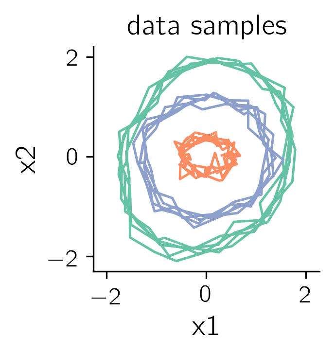
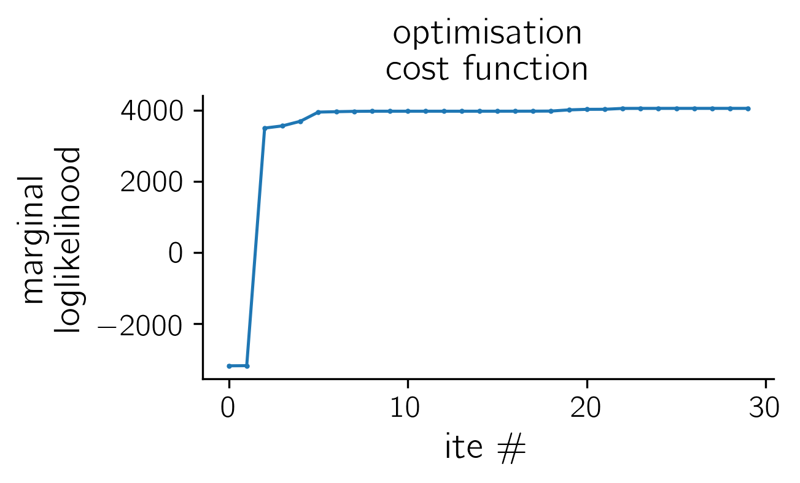

# GPFADS: Gaussian Process Factor Analysis with Dynamical Structure

## Summary

This is the repository associated to: [Non-reversible Gaussian processes for identifying latent dynamical structure in neural data - NeurIPS (2020)](https://vrutten.github.io/publications/rutten-neurips-2020/) 

The repo contains three main classes:
- a Kernel class allowing one to build various d-dimensional non-reversible multi-output kernels
- a GPregression class to run GP regression on input data
- a GPFA class to run GPFA with reversible or non-reversible priors


## Requirements
- python-3
- scipy
- [autograd](https://github.com/HIPS/autograd)


## Non-time reversible multi-output GP kernels

Class for building non-reversible kernels

### Basic demo
Example of how to build and sample from a non-time-reversible kernel
``` bash
     python ./examples/draw_samples.py
```

Using kernel class build N-d multi-output GP non-rev GP.<br>
Here covariances shown for `N = 2` and with `squared exponentials` marginals and sample draws. 
Other marginals are available in class.
<p align="center">
 
 
</p>

## GP regression with non-reversible priors

Basic class to run GP-regression using non-rev prior

### Basic demo

Run GP regression on toy data, optimise and show posterior mean inferred on test data whilst only conditioning on one of the two observed variables. 

``` bash
     python ./examples/gpregression_demo.py
```

<p align="center">
  
   
</p>

<p align="center">
 
</p>


## GPFADS - Gaussian Process Factor Analysis with Dynamical Structure
a.k.a.: GPFA with non-reversible priors

### Basic demo

Run GPFADS to unmix 2 dynamical processes and infer posterior mean on test data.

<p align="center">
 
 
</p>


<p align="center">
 
</p>


## References

- [Non-reversible Gaussian processes for identifying latent dynamical structure in neural data - NeurIPS (2020)](https://vrutten.github.io/publications/rutten-neurips-2020/)

