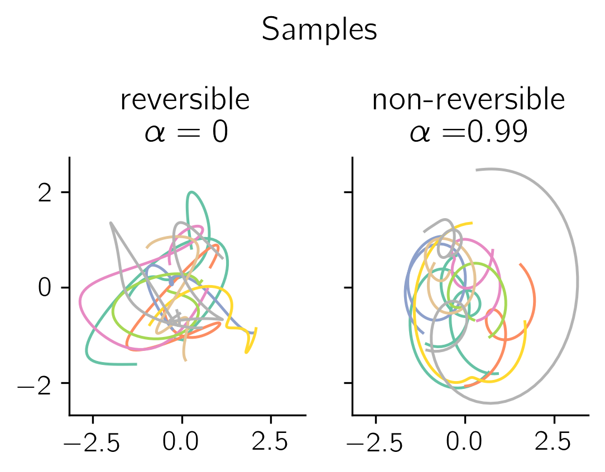

# GPFADS
Gaussian Process Factor Analysis with Dynamical Structure

## Requirements
- python3
- scipy
- [autograd](https://github.com/HIPS/autograd)

## Non-time reversible multi-output GP kernels

### Demo
To build and sample from non-rev kernel 

     python ./examples/draw_samples.py

## Running

## References

